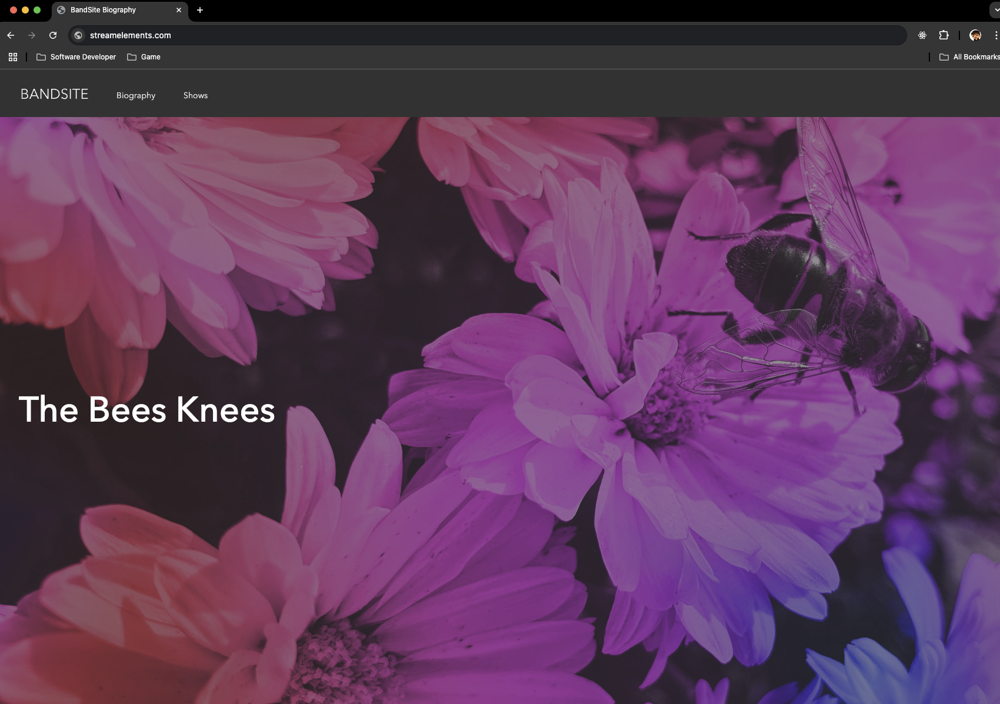
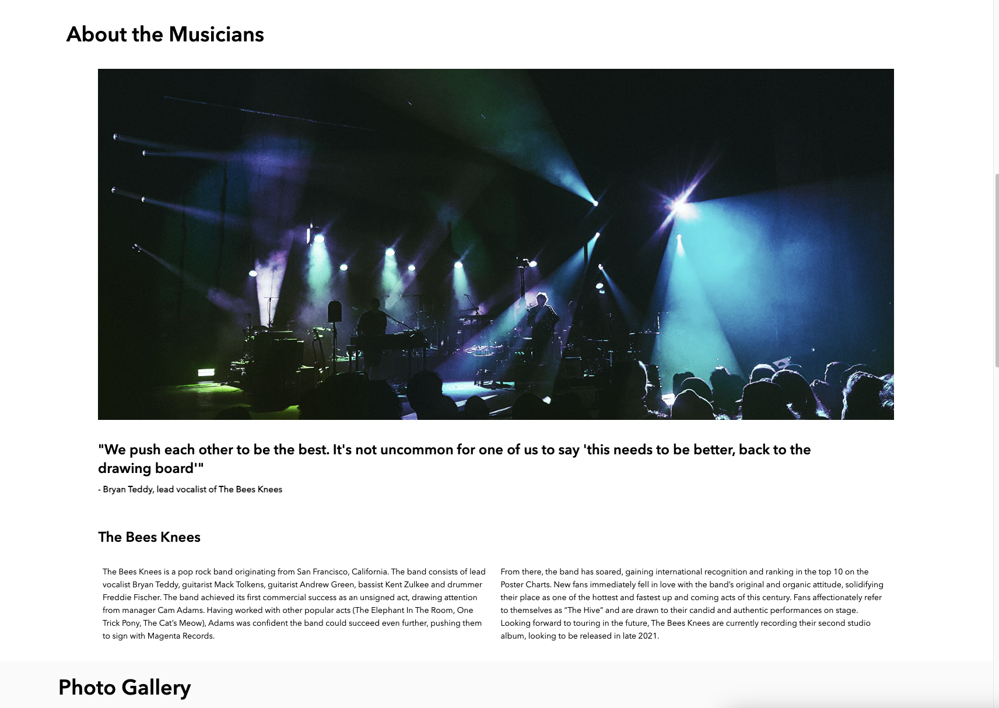
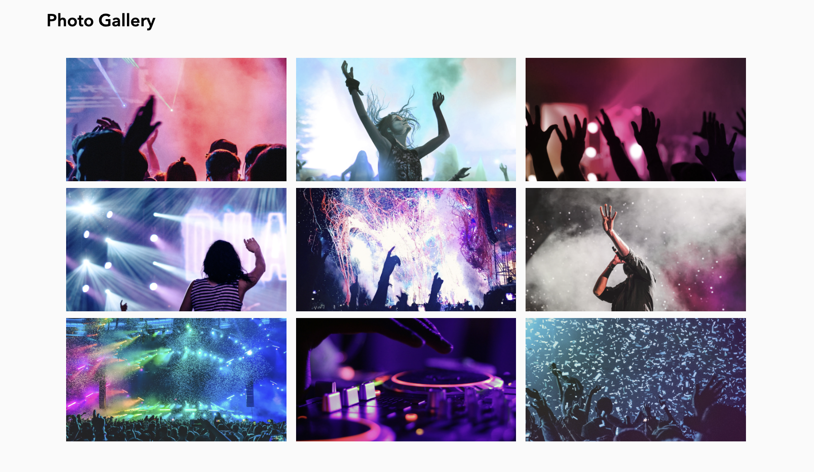
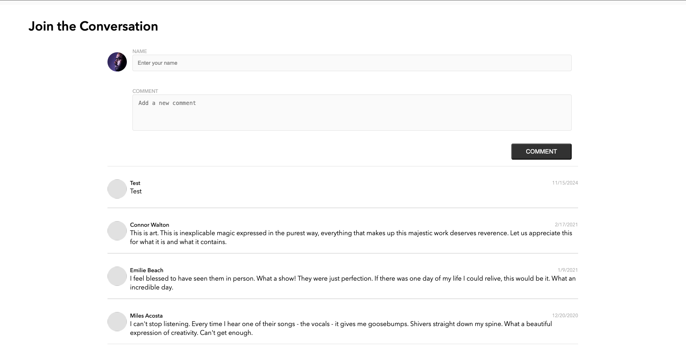
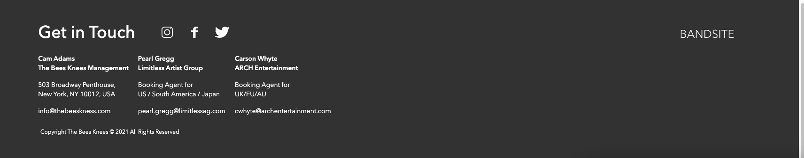
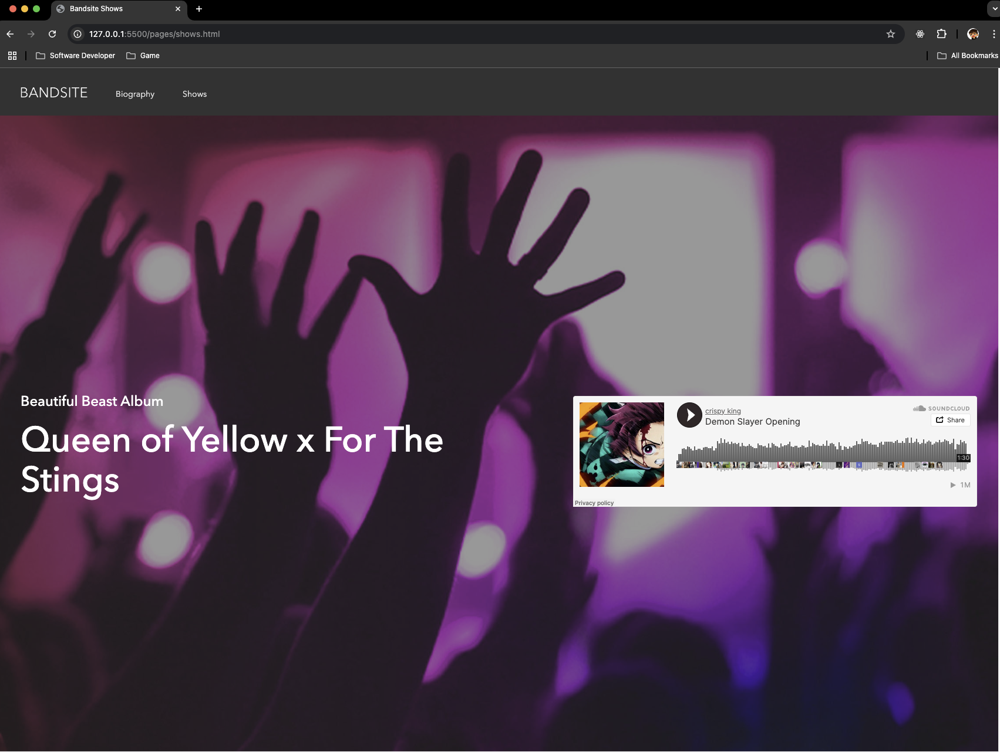
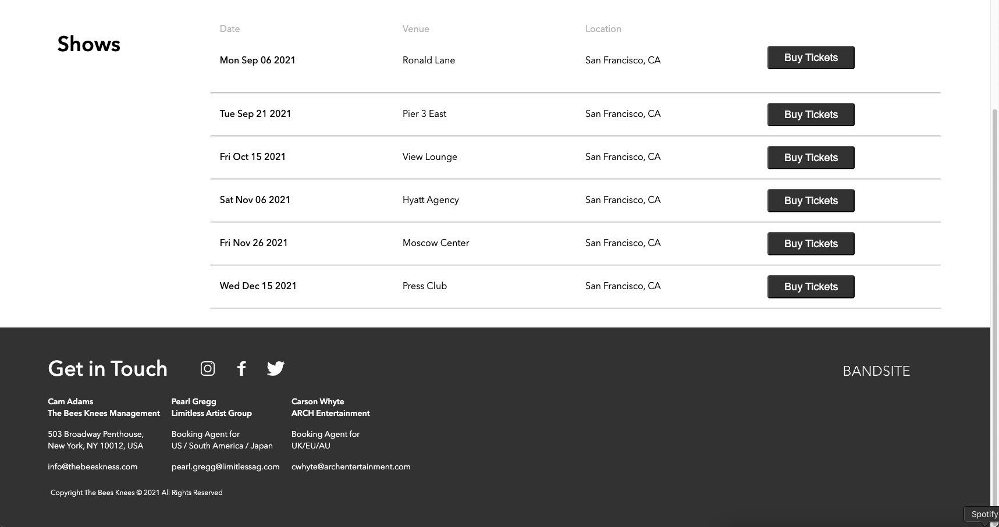

Bandit Biography Website

A two-page biography website created as part of a bootcamp project, based on a Figma design. The project demonstrates skills in JavaScript, Sass, CSS, and HTML, delivering a fully responsive and interactive experience.

Features

Page 1: Biography

    •	Hero Section: Features a striking header with a welcome message.
    •	About Section: Provides a detailed biography of the bandit.
    •	Photo Gallery: A carousel or grid showcasing various images.
    •	Join the Conversation: Users can leave comments, adding an interactive touch.
    •	Footer: Social media links for easy navigation.

Page 2: Show Page

    •	Hero Section with SoundCloud Embed: Includes an iframe to play music tracks directly from SoundCloud.
    •	Show Times Section: Displays upcoming shows in a clean, informative layout.

Screenshots

Technologies Used

    •	HTML5: Structuring the web pages.
    •	Sass/CSS3: Styling with a focus on responsiveness and scalability.
    •	JavaScript: Adding interactivity, including the comments section.
    •	SoundCloud Iframe: Embedding audio content seamlessly.

How to Run the Project

    1.	Clone the repository:

git clone https://github.com/AnthonyQuispe/anthony-quispe-bandsite

    2.	Navigate to the project directory:

cd bandit-biography

    3.	Open index.html in your preferred browser to view the biography page.
    4.	Navigate to the show.html file to view the show page.

Lessons Learned

    •	Building a fully responsive site from a Figma design.
    •	Integrating third-party content via iframes.
    •	Enhancing interactivity with a comment system.

Future Enhancements

    •	Add a backend to store and manage comments persistently.
    •	Implement advanced animations using JavaScript or CSS.
    •	Expand the SoundCloud functionality to include playlists or dynamic track selection.

Acknowledgments

Special thanks to BrainStation for guidance and support throughout this project.

License

This project is licensed under the MIT License.
